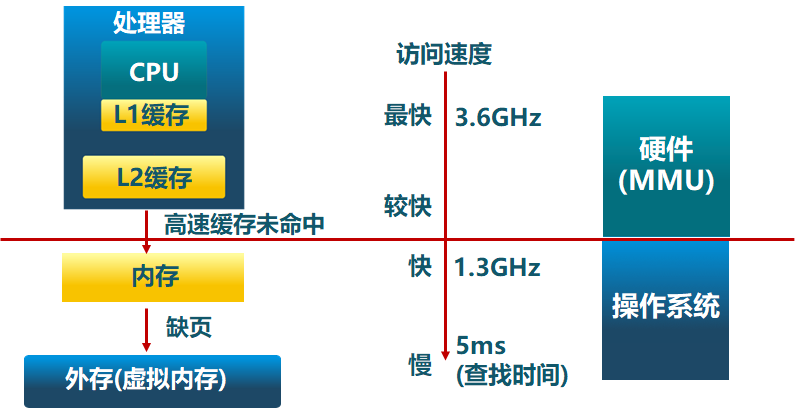

内存层次结构：

操作系统中采用的内存管理

- 抽象：逻辑地址空间（在CPU运行的进程看到的地址）
- 保护：独立的地址空间
- 共享：不同进程访问相同内存
- 虚拟化：更大的地址空间

内存管理方式

- 重定位
- 分段
- 分页
- 虚拟存储

物理地址空间 - 硬件支持的地址空间

逻辑地址空间 - 在CPU运行的进程中看到的地址

地址生成时机：

- 编译时：起始地址已知。如果起始地址改变，必须重新编译
- 加载时：编译时起始地址未知，编译器生成可重定位的代码。加载时，生成绝对地址
- 运行时：执行时代码可移动，需地址转换（映射）硬件支持

**连续内存分配**：给进程分配一块不小于指定大小的连续内存区域

- 内存碎片：空间内存不能被应用
  - 外部碎片：分配单元之间的未被使用的内存
  - 内部碎片：分配单元内部的未被使用的内存，取决于分配单元大小是否要取整
- 操作系统需要维护的数据结构
  - 所有进程的已分配分区
  - 空闲分区（Empty-blocks）
- 分配策略
  - 最先匹配（先找到的）：简单、外部碎片、分配大块时较慢
  - 最佳匹配（差不多的）：外部碎片相对减少
  - 最差匹配（最大的）：避免出现太多的小碎片、容易破坏大的空闲分区

**碎片整理**

- 紧凑
  - 通过移动分配给进程的内存分区，以合并外部碎片
  - 条件：所有的应用程序可动态重定位
- 分区对换：通过抢占并回收处于等待状态进程的分区（暂存到外存），以增大可用内存空间
- 伙伴系统

连续内存分配的缺点

- 存在内碎片、外碎片
- 物理内存必须是连续的
- 内存分配的动态修改困难
- 内存利用率低

非连续分配的设计目标：提高内存利用效率和管理灵活性

- 非连续的物理地址
- 允许共享代码和数据
- 支持动态加载和动态链接

## 段式存储管理

- 逻辑地址空间分成了多个段：堆、堆栈、数据段、代码段
- 段表示访问方式和存储数据等属性相同的一段地址空间，对应一个连续的内存块
- 若干个段组成逻辑地址空间

- 段访问
  - 逻辑地址由二元组（段号，段内偏移）表示
  - 段表存储段基址和段长度（通过段号可以找到对应段表项目）

## 页式存储管理

- 帧：物理地址空间划分成大小相同的基本分配单位
- 页：逻辑地址空间也划分成和帧相同大小的基本分配单位（帧与页的大小必须相等）
- 页到帧：逻辑地址转换到的物理地址，使用页表
- 页表：保存逻辑地址与物理地址之间的映射关系。有页表基址，然后通过页号得到帧号

**页表**

- 简述
  - 每个进程都有一个页表
  - 每个页面对应一个页表项
  - 随进程运行状态而动态改变
  - 通过页表基址寄存器（PTBR，Page Table Base Register）找到页表
  - 页表项：帧号，标志位（存在位、修改位、引用位）
- 问题
  - 性能差：访问一个内存单元需要多次访问内存（访问数据 +1、获取页表项 +n）
  - 页表可能非常大
- 优化
  - 快表：缓存近期访问的页表项
  - 多级页表：树形结构。相对单级页表，每一级的页表数量变少了，而在实际进程中，一些层级的页表可以不需要存储了，可以也少页表的大小
  - 反置页表

**段页式存储管理** 结合了二者的优点：在段式存储管理基础上，给每个段加一级页表

- 段式存储在内存保护方面有优势

- 页式存储在内存利用和优化转移到后备存储方面有优势。
