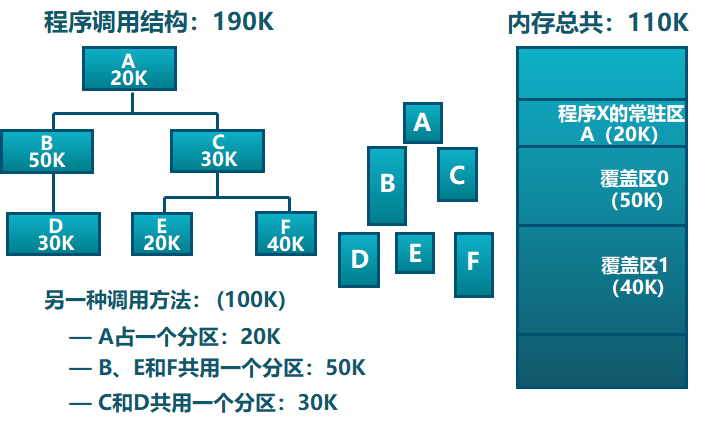

存储器层次结构：

为了解决内存空间不够用的问题：

- 覆盖（overlay）
  - 目标：在较小的可用内存中运行较大的程序
  
  - 方法：依据程序逻辑结构，将程序划分为若干功能相对独立的模块；将不会同时执行的模块共享同一块内存区域
  
  - 示例：
  
    
  
  - 缺点：
    - 编程困难：需程序员划分功能模块，并确定模块间的覆盖关系；增加了编程的复杂度
    - 增加执行时间：从外存装入覆盖模块，以时间换空间
- 交换（swapping）
  - 目标：增加正在运行或需要运行的程序的内存
  - 方法：可将暂时不能运行的程序放到外存

- **虚拟存储**
  
  - 只把部分程序放到内存中，从而运行比物理内存大的程序
  - 实现进程在内存与外存之间的交换，从而获得更多的空闲内存空间

**局部性原理**：程序在执行过程中的一个较短时期，所执行的指令地址和指令的操作数地址，分别局限于一定区域

- 时间局部性：一条指令的一次执行和下次执行，一个数据的一次访问和下次访问都集中在一个较短时期内（一旦一个指令被执行了或者一个数据被访问，则在不久的将来，它可能再被执行或被访问）
- 空间局部性：当前指令和邻近的几条指令，当前访问的数据和邻近的几个数据都集中在一个较短时期内被执行和被访问（一旦一个指令一个存储单元被访问，那么它附近的单元也将很快被访问）
- 分支局部性：一条跳转指令的两次执行，很可能跳到相同的内存位置

- 意义：局部性原理使得，从理论上来说，虚拟存储技术是能够实现的，而且可取得满意的效果

**虚拟存储**

- 原理：将不常用的部分内存块暂存到外存
- 流程
  - 装载程序时，只将当前指令执行需要的部分页面或段装入内存，将内存中暂时不用的页面或段保存到外存
  - 指令执行中需要的指令或数据不在内存（称为**缺页或缺段**）时，处理器通知操作系统将相应的页面或段调入内存
  
- 实现方式：虚拟页式存储、虚拟段式存储

- 特点：物理内存分配非连续、超出物理内存的虚拟内存、支队部分虚拟地址空间进行调入与调出

虚拟页式存储：在页式存储管理的基础上，增加请求调页和页面置换

- 当用户程序要装载到内存运行时，只装入部分页面，就启动程序运行
- 进程在运行中发现有需要的代码或数据不在内存时，则向系统发出缺页异常请求
- 操作系统在处理缺页异常时，将外存中相应的页面调入内存，使得进程能继续运行

**缺页异常**

- 处理流程：
    
    1. 去页表中查找空闲物理页面，找到了则分配物理页帧，没找到则缺页异常转到2
    2. 根据页面置换算法选择被替换掉的物理页帧 f 对应的逻辑页 q
    3. 如果 q 被修改过，则写回外存，将 q 的驻留位改为0
    4. 将要访问的页 p 装入到物理页帧 f 对应的内存中，页表驻留位改为1，对应的物理页帧号改为 f
    5. 重新执行缺页的指令
- 有效存储访问时间 = 访问内存时间 × (1-缺页率p) + 缺页异常处理时间 × 缺页率p

**页面置换算法**

简述：当出现缺页异常，需调入新页面而内存已满时，置换算法选择被置换的物理页面

设计目标：尽可能减少页面的调入调出次数、把未来不再访问或短期内不访问的页面调出

算法分类
- **局部页面置换算法**：置换页面的选择范围仅限于当前进程占用的物理页面内
  - 最优（OPT, optimal）：置换在未来最长时间不访问的页面（但未来不可预测）
  - 先进先出（First-In First-Out, FIFO）：选择在内存驻留时间最长的页面进行置换
  - 最近最久未使用（Least Recently Used, LRU）：选择最长时间没有被引用的页面进行置换
  - 时钟算法（Clock）：仅对页面的访问情况进行大致统计（LRU和FIFO的折中）
  - 最不常用算法（Least Frequently Used, LFU）：每个页面设置一个访问计数缺页时，访问页面时，访问计数加1。置换访问次数最少的页面
- 全局页面置换算法：为进程分配可变数目的物理页面
  - 工作集算法：换出不在工作集中的页面
    - 工作集：一个进程当前一段时间内正在使用的逻辑页面集合
    - 常驻集：在当前时刻，进程实际驻留在内存当中的页面集合
  - 缺页率算法：通过调节常驻集大小，使每个进程的缺页率保持在一个合理的范围内
    - 缺页率：缺页次数/内存访问次数 或 缺页平均时间间隔的倒数

时钟算法（Clock）：

- 数据结构：
  - 在页表项中增加访问位，描述页面在过去一段时间的内访问情况
  - 各页面组织成环形链表
  - 指针指向最先调入的页面
- 实现：
  - 页面装入内存时，访问位初始化为0
  - 访问页面（读/写）时，访问位置1
  - 缺页时，从指针当前位置顺序检查环形链表：访问位为0，则置换该页；访问位为1，则访问位置0，并指针移动到下一个页面，直到找到可置换的页面

Belady现象：采用FIFO、Clock等算法时，可能出现分配的物理页面数增加，缺页次数反而升高的异常现象。

CPU利用率与并发进程数的关系

- 进程数少时，提高并发进程数，可提高CPU利用率
- 并发进程导致内存访问增加，并发进程的内存访问会降低了访存的局部性特征，局部性特征的下降会导致缺页率上升和CPU利用率下降（抖动）

负载控制：通过调节并发进程数来进行系统负载控制，减少抖动

- 所有进程的工作集大小 = 内存的大小
- 平均缺页间隔时间 = 缺页异常处理时间

