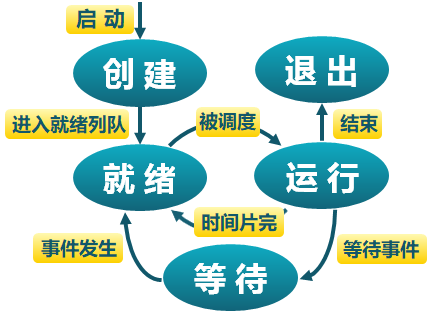
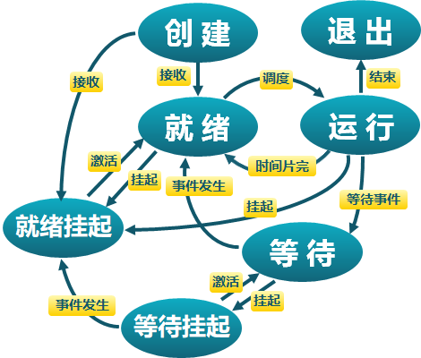

**进程**

- 是指一个具有一定独立功能的程序在一个数据集合上的一次动态执行过程
- 进程包含了正在运行的一个程序的所有状态信息：代码、数据、寄存器、系统资源（打开文件、已分配内存等）
- 程序 = 文件（静态的可执行文件）
- 进程 = 执行中的程序 = 程序 + 执行状态
- 特点：动态性（动态创建结束）、并发性、独立性、制约性（因访问共享数据/资源或进程间同步而产生制约）
- 进程控制块（PCB）：操作系统管理控制进程运行所用的信息集合
  - PCB 是进程存在的唯一标志
  - 包含：进程标志信息、处理机现场保存、进程控制信息
  - 组织形式：
    - 链表（同一状态的进程其 PCB 成一链表，多个状态对应多个不同的链表）
    - 索引表（同一状态的进程归入一个索引表（由索引指向 PCB），多个状态对应多个不同的索引表）
  


**五状态进程模型**：

- 创建状态：一个进程正在被创建，还没被转到就绪状态之前的状态
- 就绪状态：进程获得了除处理机之外的所需资源，得到处理机即可运行
- 运行状态：进程正在处理机上运行
- 等待状态（阻塞状态）：进程正在等待某一事件（例如等待I/O请求、等待子进程结束）的出现而暂停运行
- 结束状态：一个进程正在从系统中消失时的状态，这是因为进程结束或由于其他原因所导致




**进程挂起**：挂起是把一个进程从内存转到外存。目的是减少进程占用内存

- 等待挂起状态：进程在外存中并等待某事件的出现
- 就绪挂起状态：进程在外存中，但只要进入内存，就可以运行




状态队列：由操作系统来维护的一组队列，表示系统中所有进程的当前状态

- 不同队列表示不同状态：就绪队列、等待队列等

- 根据进程状态不同，进程PCB加入相应队列，进程状态变化时，它所在的PCB会从一个队列
  换到另一个

  


**进程的创建与加载、切换、退出**

- 进程的创建与加载
  - Window使用 CreateProcess
  - Unix使用 fork/exec
    - fork() ：把一个进程复制成二个进程
      - 作用：创建一个子进程，并复制父进程地址空间中的内容
      - 返回值：用以区分当前是在子进程还是父进程
        - 子进程的 fork() 返回 0
        - 父进程的 fork() 返回子进程标识符
        - 出现错误返回负值
    
  - exec() ：加载新程序取代当前运行进程（ PID 没有改变）
    
    - ```c
      main() {
          …
          int pid = fork();		// 创建子进程
          if (pid == 0) {			// 子进程在这里继续
              exec_status = exec(“calc”, argc, argv0, argv1, …);
              printf(“Why would I execute?”);
          }  else {				// 父进程在这里继续
              …
              child_status = wait(pid);
          }
          if (pid < 0) {
              // 错误
          }
      }
      ```
  
- 进程的切换
  - 暂停当前运行进程，从运行状态变成其他状态
  - 调度另一个进程从就绪状态变成运行状态
  - 切换前，保存上一个进程的上下文信息

- 进程的等待与退出
  - wait()系统调用用于父进程等待子进程的结束
  - 进程结束执行时调用exit()，完成进程资源回收


其他进程控制系统调用

- `nice()` 指定进程的初始优先级
- `ptrace()` 允许一个进程控制另一个进程的执行
- `sleep()` 可以让进程在定时器的等待队列中等待


**线程** 是进程的一部分，描述指令流执行状态。它是进程中的指令执行流的最小单元，是CPU调度的基本单位。


**为什么引入线程**？

- 创建、结束、切换进程系统开销比较大
  - 展开来说：由于进程是资源的拥有者，所以在创建、结束、切换操作中需要较大的时空开销，限制了并发程度的进一步提高。为减少进程切换的开销，把进程作为资源分配单位和调度单位这两个属性分开处理，即进程还是作为资源分配的基本单位，但是不作为调度的基本单位，把调度执行与切换的责任交给“线程”。这样做的好处不但可以提高系统的并发度，还能适应新的对称多处理机（SMP）环境的运行，充分发挥其性能。
- 线程之间方便通信，共享数据


线程优缺点：

- 优点：一个进程中可以同时存在多个线程、各个线程之间可以并发地执行、各个线程之间可以共享地址空间和文件等资源
- 缺点：一个线程崩溃，会导致其所属进程的所有线程崩溃


**线程与进程的比较**：

- 进程是资源分配单位，线程是CPU调度单位
- 进程拥有一个完整的资源平台，而线程只独享指令流执行的必要资源，如寄存器和栈
- 线程能减少并发执行的时间和空间开销
  - 线程的创建时间比进程短
  - 线程的终止时间比进程短
  - 同一进程内的线程切换时间比进程短
  - 由于同一进程的各线程间共享内存和文件资源，可不通过内核进行直接通信


**线程的三种实现方式** 

- 用户线程：由一组用户级的线程库函数来完成线程的管理，包括线程的创建、终止、同步和调度等
  - 优点：
    - 不依赖于操作系统的内核
    - 同一进程内的用户线程切换速度快（无需用户态/核心态切换）
    - 允许每个进程拥有自已的线程调度算法
  - 缺点
    - 线程执行系统调用而被阻塞会影响其他线程
    - 以进程为单位进行CPU实践分配，多线程程序每个线程分到的CPU时间很少
- 内核线程：由内核通过系统调用实现的线程机制，由内核完成线程的创建、终止和管理
  - 优点：
    - 线程执行系统调用而被阻塞不影响其他线程
    - 线程的创建、终止和切换相对较大（通过系统调用/内核函数，在内核实现）
  - 缺点
    - 以线程为单位进行CPU时间分配，多线程的进程可获得更多CPU时间
- 轻量级进程（LightWeight Process）：内核支持的用户线程。一个进程可有一个或多个轻量级进程，每个轻量级进程由一个单独的内核线程来支持，轻量级进程可以对于一个或多个用户线程（结合了用户线程、内核线程的特点，但是这种实现实际运用不太理想）


