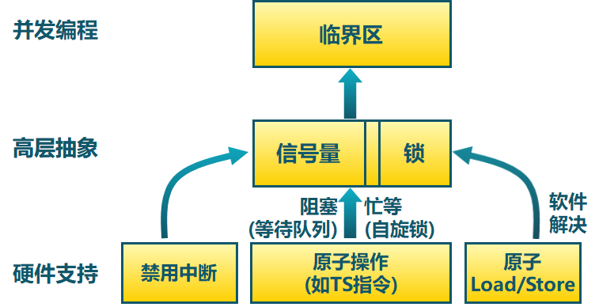
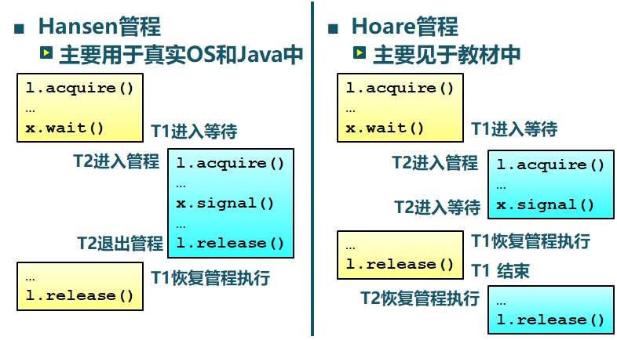

基本同步方法：




**信号量 **是操作系统提供的一种协调共享资源访问的方法。也是被保护的整数变量，初始化完成后，只能通过 `P()` 和 `V()` 操作修改

- 由一个整型（sem）变量和两个原子操作组成
- `P()` ：sem - 1，如 sem<0, 进入等待, 否则继续
- `V()` ：sem + 1，如 sem≤0,唤醒一个等待进程
- 由操作系统保证 PV 操作是原子操作

```c++
class Semaphore
{
    int sem;
    WaitQueue q;
};
Semaphore::P()
{
    sem--;
    if(sem<0)
    {
        add this thread to q;
        block(q);
    }
}
Semaphore::V()
{
    sem++;
    if(sem<=0)
    {
        remove a thread t form q;
        wakeup(t);
    }
}
```


用信号量实现临界区的 **互斥访问**

```c
mutex  = new Semaphore(1);
mutex->P();
// 临界区
mutex->V();
```


用信号量实现 **条件同步**

```c
condition = new Semaphore(0);

//线程A
condition->P(); //线程A等待线程B执行condition->V()继续执行下去

线程B
condition->V();
```


生产者-消费者问题：

- 生产者→缓冲区→消费者

- 任何时刻只能有一个线程操作缓冲区（互斥访问）
- 缓冲区空时，消费者必须等待生产者（条件同步）
- 缓冲区满时，生产者必须等待消费者（条件同步）


用信号量解决生产者-消费者问题

```c
Class BoundedBuffer 
{
    mutex = new Semaphore(1);
    fullBuffers = new Semaphore(0);
    emptyBuffers = new Semaphore(n);
}
BoundedBuffer::Deposit(c) 
{
    emptyBuffers->P(); 
    mutex->P(); 
    Add c to the buffer;
    mutex->V();
    fullBuffers->V();
}
BoundedBuffer::Remove(c) 
{
    fullBuffers->P();
    mutex->P();
    Remove c from buffer;
    mutex->V();
    emptyBuffers->V();
}
```


**管程** 是一种用于多线程互斥访问共享资源的程序结构

- 介绍
  - 采用面向对象方法，简化了线程间的同步控制
  - 任一时刻最多只有一个线程执行管程代码
  - **正在管程中的线程可临时放弃管程的互斥访问，等待事件出现时恢复**  (管程特点，这里区别于信号量)

- 组成
  - 一个锁，控制管程代码的互斥访问
  - 0或者多个条件变量，管理共享数据的并发访问


**条件变量 **是管程内的等待机制

- 进入管程的线程因资源被占用而进入等待状态
- 每个条件变量表示一种等待原因，对应一个等待队列
- `Wait()`操作
  - 将自己阻塞在等待队列中
  - 唤醒一个等待者或释放管程的互斥访问
- `Signal()`操作
  - 将等待队列中的一个线程唤醒
  - 如果等待队列为空，则等同空操作

```c
Class Condition 
{
    int numWaiting = 0;
    WaitQueue q;
}
Condition::Wait(lock) 
{
    numWaiting++;
    Add this thread t to q;
    release(lock);
    schedule(); // need mutex
    require(lock);
}
Condition::Signal() 
{
    if (numWaiting > 0) 
    {
        Remove a thread t from q;
        wakeup(t); // need mutex
        numWaiting--;
    }
}
```


用管程解决生产者-消费者问题

```c
class BoundedBuffer 
{
    …
    Lock lock;
    int count = 0;
    Condition notFull, notEmpty;
}
BoundedBuffer::Deposit(c) 
{
    lock->Acquire();
    while (count == n)
        notFull.Wait(&lock);
    Add c to the buffer;
    count++;
    notEmpty.Signal();
    lock->Release();
}
BoundedBuffer::Remove(c) 
{
    lock->Acquire();
    while (count == 0)    
      notEmpty.Wait(&lock);
    Remove c from buffer;
    count--;
    notFull.Signal();
    lock->Release();
}
```


管程条件变量的释放处理方式



Hansen 管程他是让在管程中的线程更优先，切换两次进程，更高效。（所以wait时使用while，因为尽管 T2 释放 `x.signal` 之后，还有可能会对资源做修改）

Hoare 管程是让在等待队列中的更优先，切换三次进程，低效。（所以wait时使用 if ）


**哲学家就餐问题**：

- 5个哲学家围绕一张圆桌而坐，桌子上放着5支叉子，每两个哲学家之间放一支
- 哲学家的动作包括思考和进餐，进餐时需同时拿到左右两边的叉子，思考时将两支叉子放回原处
- 如何保证哲学家们的动作有序进行？如：不出现有人永远拿不到叉子

方案1，会出现死锁：

```c
#define N 5
semaphore fork[5]; // 信号量初值为1
void philosopher(int i)
{
	while(true)
	{
		think();
        P(fork[i]);
        P(fork[i + 1] % N);
        eat;
        V(fork[i]);
        V(fork[i + 1] % N);
	}
}
```

方案2，效率较低，只允许一个人就餐：

```c
#define N 5
semaphore fork[5]; // 信号量初值为1
semaphore mutex; // 互斥信号量，初值1
void philosopher(int i)
{
	while(true)
	{
		think();
        P(mutex);
        P(fork[i]);
        P(fork[i + 1] % N);
        eat;
        V(fork[i]);
        V(fork[i + 1] % N);
        V(mutex);
	}
}
```

方案3，没有死锁，允许多人同时就餐：

```c
#define N 5
semaphore fork[5]; // 信号量初值为1
void philosopher(int i)
{
	while(true)
	{
		think();
        if(i&0x01)
        {
			P(fork[i]);
        	P(fork[i + 1] % N);        
        } 
        else 
        {
        	P(fork[i + 1]);
        	P(fork[i] % N);
        }
        eat;
        V(fork[i]);
        V(fork[i + 1] % N);
	}
}
```


**读者/写者问题**

共享数据的两类使用者

- 读者：只读取数据，不修改
- 写者：读取和修改数据

读者-写者问题描述：对共享数据的读写

- “读－读”允许：同一时刻，允许有多个读者同时读
- “读－写”互斥：没有写者时读者才能读、没有读者时写者才能写
- “写－写”互斥：没有其他写者时写者才能写


优先策略

- 读者优先策略
  - 只要有读者正在读状态，后来的读者都能直接进入
  - 如读者持续不断进入，则写者就处于饥饿
- 写者优先策略
  - 只要有写者就绪，写者应尽快执行写操作
  - 如写者持续不断就绪，则读者就处于饥饿


用信号量解决读者-写者问题

```c
WriteMutex = new Semaphore(1);
CountMutex = new semaphore(1);
int count = 0; //正在进行读操作的读者数目

//-------------写者
P(WriteMutex);
	Wirte;
V(WriteMutex);

//-------------读者
P(CountMutex);
    if(count == 0)
        P(WriteMutex);
    count++;
V(CountMutex);
	read;
P(CountMutex);
count--;
if(count == 0)
	V(WriteMutex);
V(CountMutex);
```


用管程解决读者-写者问题：

```c++
AR = 0;  	   // # of active readers
AW = 0;           // # of active writers
WR = 0; 	   // # of waiting readers
WW = 0;           // # of waiting writers
Lock lock;
Condition okToRead;
Condition okToWrite;

//-------------读者
Public Database::Read() 
{
  //Wait until no writers;
  StartRead(); 
  read database;
  //check out – wake up waiting writers; 
  DoneRead(); 
}
Private Database::StartRead() 
{
    lock.Acquire();
    while ((AW+WW) > 0)
    {
        WR++;
        okToRead.wait(&lock);
        WR--;
    }
    AR++;
    lock.Release();
}
Private Database::DoneRead() 
{
    lock.Acquire();
    AR--;
    if (AR ==0 && WW > 0) 
    {
        okToWrite.signal();
    }
    lock.Release();
}

//-------------写者
Public Database::Write() 
{
  //Wait until no readers/writers;
  StartWrite(); 
  write database;
  //check out-wake up waiting readers/writers; 
  DoneWrite(); 
}
Private Database::StartWrite() 
{
    lock.Acquire();
    while ((AW+AR) > 0)  
    {
        WW++;
        okToWrite.wait(&lock);
        WW--;
    }
    AW++;
    lock.Release();
}
Private Database::DoneWrite() 
{
    lock.Acquire();
    AW--;
    if (WW > 0) 
    {
        okToWrite.signal();
    }
    else if (WR > 0) 
    {
        okToRead.broadcast();
    }
    lock.Release();
}
```


