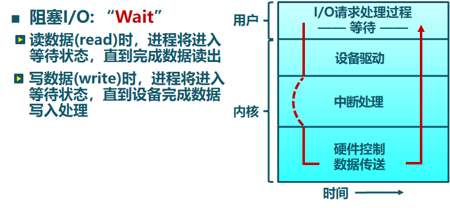
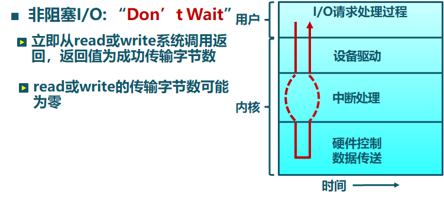
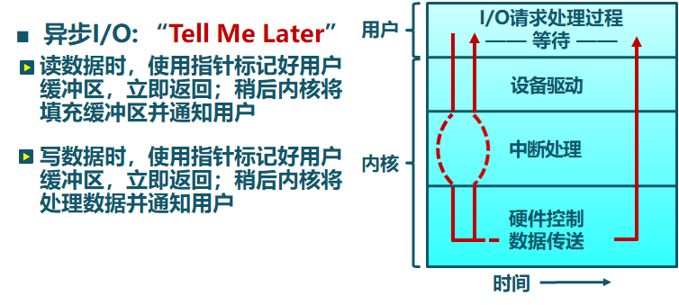
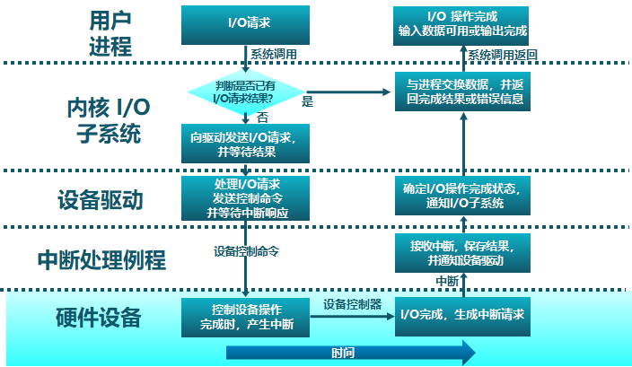
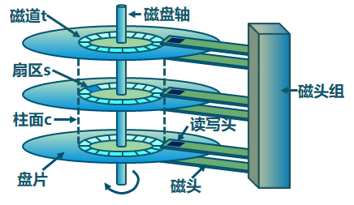
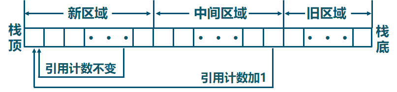

三种常见设备接口类型

- 字符设备
  - 键盘、鼠标、串口
  - 以字节为单位顺序访问，通过 `get`、`put`等
- 块设备
  - 磁盘、磁带、光驱
  - 均匀的数据块访问、原始I/O命令或文件系统接口
- 网络设备
  - 以太网、无线、蓝牙
  - 格式化报文交换，通过 `send` / `receive `网络报文

阻塞I/O、非阻塞I/O、异步I/O：

**设备控制器** 是 CPU和I/O设备间的接口，向CPU提供特殊指令和寄存器

CPU通过 I/O地址用来控制I/O硬件

- I/O指令：通过I/O端口号访问设备寄存器，`out 0x21, AL`
- 内存映射I/O：设备的寄存器/存储被映射到内存物理地址空间中，通过内存 `load`/`store`指令完成I/O操作

CPU与设备的通信方式包括：

- 查询：I/O 设备在特定的状态寄存器中放置状态和错误信息，操作系统定期检测状态寄存器
- 设备中断
- 直接内存访问 (DMA)

I/O请求生存周期：

CPU与设备控制器的数据传输

- 程序控制I/O
  - 通过CPU的in/out或者load/store传输所有数据
  - 特点：硬件简单、编程容易，消耗的CPU时间和数据量成正比
  - 适用于简单的、小型的设备I/O
- 直接内存访问（DMA）
  - 设备控制器可直接访问系统总线，控制器直接与内存互相传输数据
  - 特点： 设备传输数据不影响CPU
  - 适应于高吞吐量I/O

I/O 设备通知操作系统的机制

- CPU主动查询
  - I/O 设备在特定的状态寄存器中放置状态和错误信息，操作系统定期检测状态寄存器
  - 特点：简单，I/O操作频繁或不可预测时，开销大和延时长
- 设备中断
  - 特点：处理不可预测时间效果好、开销相对较高

磁盘工作机制和性能参数

- 读取或写入时，磁头必须被定位在期望的磁道，并从所期望的柱面和扇区的开始
- 寻道时间：定位到相应磁道所花费的时间
- 旋转延迟：到达目的扇区花费的时间（平均旋转延迟时间=磁盘旋转一周时间的一半）

磁盘I/O传输时间：
$$
T_{a} = T_{s} + \frac{1}{2r} + \frac{b}{rN}
$$
其中

- $T_{s}$ 是寻道时间
- $\frac{1}{2r}$ 是旋转延迟，$\frac{1}{r}$ 是旋转一周的时间，r是磁盘转速
- $\frac{b}{rN}$ 是传输时间，b是传输的比特数，N是磁道上的比特数

磁盘调度算法：通过优化磁盘访问请求顺序来提高磁盘访问性能

- 先进先出(FIFO)：按顺序处理请求
- 最短服务时间优先(SSTF)：选择从磁臂当前位置需要移动最少的I/O请求
- 扫描算法(SCAN)：磁臂在一个方向上移动，访问所有未完成的请求，直到磁臂到达该方向上最后的磁道，然后调换方向直到处理完所有的请求（不用到磁道底）
- 循环扫描算法(C-SCAN)：当最后一个磁道也被访问过了后，磁臂返回到磁盘的另外一端再次进行
- C-LOOK算法：磁臂先到达该方向上最后一个请求处，然后立即反转，而不是先到最后点路径上的所有请求
- N步扫描(N-step-SCAN)算法
  - 磁头粘着(Arm Stickiness)现象：SSTF、SCAN及CSCAN等算法中，可能出现磁头停留在某处不动的情况，如：进程反复请求对某一磁道的I/O操作
  - 将磁盘请求队列分成长度为N的子队列、按FIFO算法依次处理所有子队列、其它扫描算法处理每个队列
- 双队列扫描(FSCAN)算法
  - FSCAN算法是N步扫描算法的简化，FSCAN只将磁盘请求队列分成两个子队列
  - 把磁盘I/O请求分成两个队列、交替使用扫描算法处理一个队列、新生成的磁盘I/O请求放入另一队列中、所有的新请求都将被推迟到下一次扫描时处理

磁盘缓存是磁盘扇区在内存中的缓存区，可以分为单缓冲和双缓冲

**磁盘缓存算法**

访问频率置换算法(Frequency-based Replacement)

- 把 LRU 算法中的特殊栈分成三部分，并在每个缓存块增加一个引用计数：新区域、旧区域、中间区域

- 栈中缓存块被访问时移到栈顶
  - 如果该块在新区域，引用计数不变（避免密集访问对引用计数不利影响）
  - 否则，引用计数加1（方便使用LFU算法）
- 在旧区域中引用计数最小的缓存块被置换（中间区域的定义是为了避免新读入的缓存块在第一次出新区域时马上被置换，有一个过渡期）

